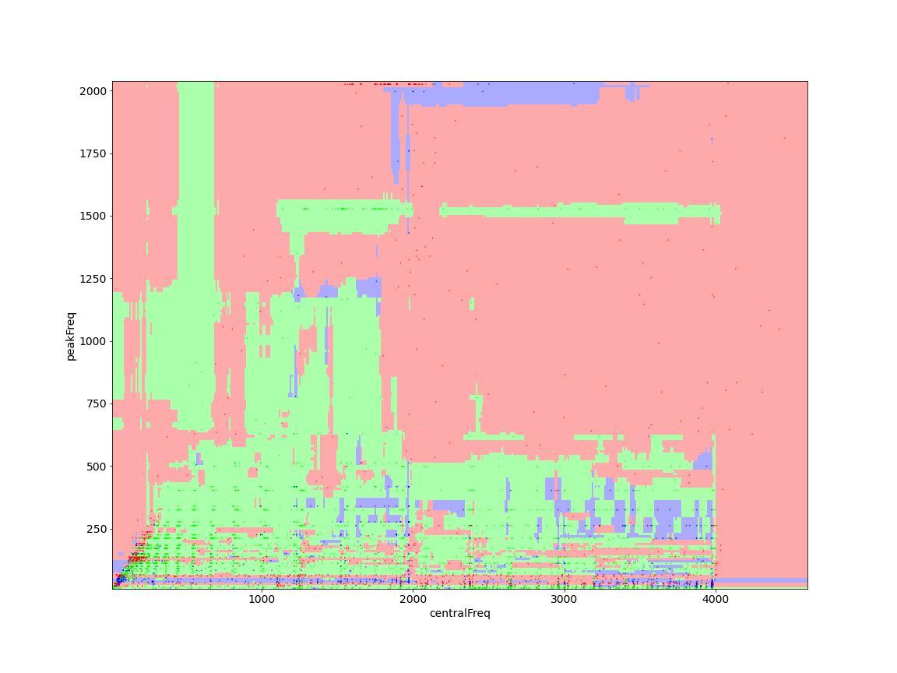

# ML Gravitational Waves Classifier

Classify gravitational waves events detected by LIGO using machine learning models with sklearn.

Project for the [*2019 Braga School Data science in (astro)particle physics and cosmology: the bridge to industry*](http://www.lip.pt/data-science-2019/?p=index)

